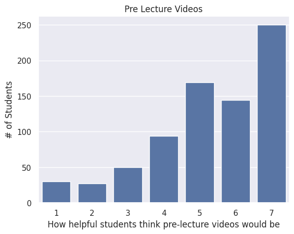
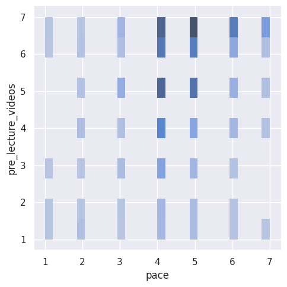
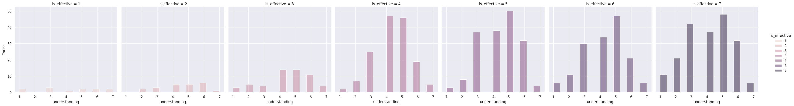

---
# Do not edit the text between these lines!
layout: default
---

# COMP110 EX09

<!-- This is a comment. Below, you'll see code for inserting an image. To make this image appear, update <custom-path>. To add an image, save it inside the imgs folder of this repository. -->

## Figure 1

This is basic paragraph text.

## Figure 2

This is basic paragraph text.

## Figure 3
